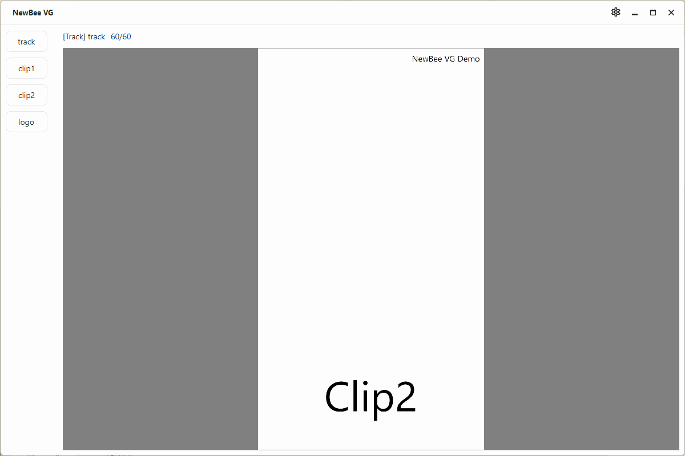

<p align="center">
  
</p>

NewBeeVG(NewBee Visual Content Generator) 是基于 [NewBeeUI](https://github.com/nscript-site/NewBeeUI) 的程序化动画/视频内容生成工具，通过 AI 编程，可以快速的制作视频内容。

在设计上，受到 [remotion](https://github.com/remotion-dev/remotion)(Make videos programmatically with React) 的启发，但要比 remotion 更间接易用。基于 nodejs 的东东，谁用谁知道 .....，吐槽 ......。我用 Trae + remotion/skills 跑了两小时，各种七七八八的 bug，痛不欲生 ...... 一怒之下，开发了这个。

# 编译

需要下载 [NewBeeVG](https://github.com/nscript-site/NewBeeVG) 的源码和 [NewBeeUI](https://github.com/nscript-site/NewBeeUI) 的源码，放在相同的目录下，运行 ·NewBeeVG.slnx· 文件即可打开项目。

# 简单示例

```csharp
var clip1 = clip(
    name: "clip1",
    frames: 30,
    builder: (ctx, clip) =>
    {
        var easing = Easing.SineInOut;
        double v = easing(ctx.progress) * 2 * Math.PI;
        var r = 900;
        var x = r * Math.Sin(v);
        var y = r * Math.Cos(v);
        return
        HGrid("*", [
            TextBlock("Clip1")
                .Align(0,0)
                .Margin(x, y, 0,0).FontSize(200)
            ]);
    }
);

var clip2 = clip(
    name: "clip2",
    frames: 30,
    builder: (ctx, clip) =>
    {
        var easing = Easing.SineInOut;        
        double v = easing(ctx.progress);

        return
        HGrid("*", [
            TextBlock("Clip2")
                .Align(0,-1)
                .Margin(0, 100 + (ctx.height - 500) * v, 0,0).FontSize(200)
            ]);
    }
);

var logo = clip(
    name: "logo",
    start: 0,
    frames: 60,
    builder: (ctx, clip) =>
    {
        return
            TextBlock("NewBee VG Demo").Align(1, -1).FontSize(40).Margin(20);
    }
);

run(stage(bg: Brushes.White), [clip1, clip2, logo]);

```

效果如下，支持热更新：



# TODO

- [ ] File Based App 示例
- [ ] 导出视频