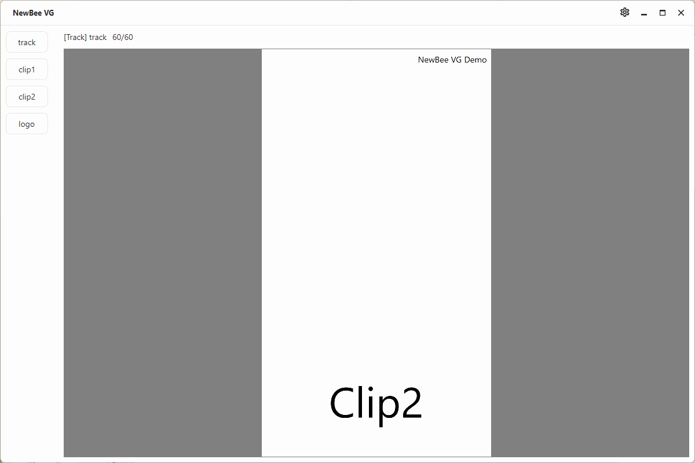

<p align="center">
  
</p>

NewBeeVG(NewBee Visual Content Generator) 是基于 [NewBeeUI](https://github.com/nscript-site/NewBeeUI) 的程序化动画/视频内容生成工具，通过 AI 编程，可以快速的制作视频内容。

在设计上，受到 [remotion](https://github.com/remotion-dev/remotion)(Make videos programmatically with React) 的启发，但要比 remotion 更间接易用。基于 nodejs 的东东，谁用谁知道 .....，吐槽 ......。我用 Trae + remotion/skills 跑了两小时，各种七七八八的 bug，痛不欲生 ...... 一怒之下，开发了这个。

NewBeeVG 集成了：
- Avalonia 的 UI 布局系统, 完整复用 Avalonia 成熟布局计算逻辑，统一规范界面与画布元素排版能力
  - 基础布局容器：内置 Grid、StackPanel、Canvas、WrapPanel 等标准布局容器；
  - 元素间距控制：统一支持 Padding（内边距）、Margin（外边距）属性；
  - 对齐与拉伸：提供 HorizontalAlignment / VerticalAlignment 对齐、Stretch 尺寸拉伸策略；
  - 尺寸约束：支持 Width/Height、Min/Max 尺寸限制、比例自适应、内容自适应布局；
  - 跨平台兼容：布局逻辑完全跨平台统一，Windows/macOS/Linux 渲染排版无差异；
- SkiaSharp 底层 2D 矢量图形渲染内核, 基于 Google Skia 2D 图形库作为底层画布绘制引擎，承担全框架 2D 绘制能力
  - 矢量绘图：路径、矩形、圆形、圆角、贝塞尔曲线、多边形、渐变填充、描边、蒙版裁剪；
  - 文本渲染：多行文本、字体缓存、字重 / 字号 / 字间距调整、文字渐变；
  - 图像处理：PNG/JPG/WebP 解码、纹理缓存、图像缩放、滤镜、透明度混合；
- Typst 专业结构化排版引擎, 内置 Typst 编译内核，支持在画布内嵌入专业学术 / 文档排版内容，实现图文混排
  - 语法支持：数学公式、图表、化学方程式等；
  - 实时渲染：将 Typst 源码编译为矢量图形，直接嵌入布局容器，和 UI 元素自由混排；
  - 批量导出：支持无头模式批量编译文档、生成论文插图、公式矢量图；
  - 场景适配：学术性动画。
- [待实现] libgodot 高性能 3D 渲染内核，集成编译为共享库的 Godot Engine（libgodot），提供完整 3D 实时 / 离线渲染、动画能力
  - 完整 3D 管线：Vulkan 硬件光栅渲染、PBR 材质、光照系统、阴影、后处理；
  - 动画体系：关键帧动画、骨骼角色动画、路径漫游、机械联动、粒子特效；
  - 模型支持：GLB/GLTF/FBX 网格加载、材质资源、相机控制；


# 编译

需要下载 [NewBeeVG](https://github.com/nscript-site/NewBeeVG) 的源码和 [NewBeeUI](https://github.com/nscript-site/NewBeeUI) 的源码，放在相同的目录下，运行 ·NewBeeVG.slnx· 文件即可打开项目。

# 简单示例

```csharp
var clip1 = clip(
    name: "clip1",
    frames: 30,
    builder: (ctx, clip) =>
    {
        var easing = Easing.SineInOut;
        double v = easing(ctx.progress) * 2 * Math.PI;
        var r = 900;
        var x = r * Math.Sin(v);
        var y = r * Math.Cos(v);
        return
        HGrid("*", [
            TextBlock("Clip1")
                .Align(0,0)
                .Margin(x, y, 0,0).FontSize(200)
            ]);
    }
);

var clip2 = clip(
    name: "clip2",
    frames: 30,
    builder: (ctx, clip) =>
    {
        var easing = Easing.SineInOut;        
        double v = easing(ctx.progress);

        return
        HGrid("*", [
            TextBlock("Clip2")
                .Align(0,-1)
                .Margin(0, 100 + (ctx.height - 500) * v, 0,0).FontSize(200)
            ]);
    }
);

var logo = clip(
    name: "logo",
    start: 0,
    frames: 60,
    builder: (ctx, clip) =>
    {
        return
            TextBlock("NewBee VG Demo").Align(1, -1).FontSize(40).Margin(20);
    }
);

run(stage(bg: Brushes.White), [clip1, clip2, logo]);

```

效果如下，支持热更新：



# TODO

- [x] File Based App 示例
- [x] 导出视频