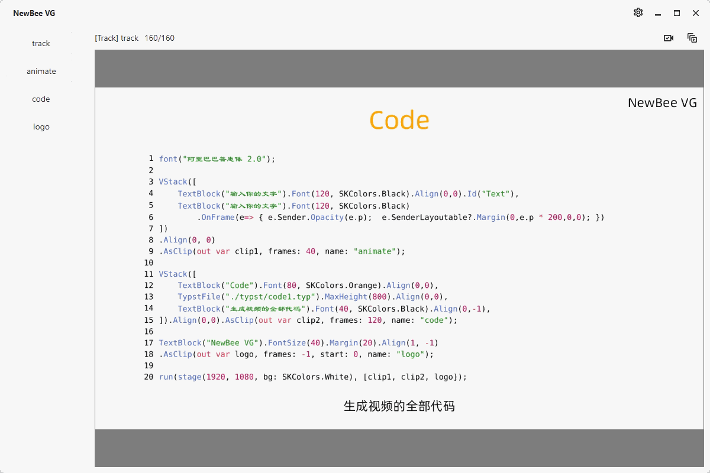

<p align="center">
  
</p>

NewBeeVG(NewBee Visual Content Generator) 是基于 [NewBeeUI](https://github.com/nscript-site/NewBeeUI) 的程序化动画/视频内容生成工具，通过 AI 编程，可以快速的制作视频内容。

在设计上，受到 [remotion](https://github.com/remotion-dev/remotion)(Make videos programmatically with React) 的启发，但要比 remotion 更间接易用。基于 nodejs 的东东，谁用谁知道 .....，吐槽 ......。我用 Trae + remotion/skills 跑了两小时，各种七七八八的 bug，痛不欲生 ...... 一怒之下，开发了这个。

NewBeeVG 集成了：
- [Avalonia](https://avaloniaui.net/) 的 UI 布局系统, 完整复用 Avalonia 成熟布局计算逻辑，统一规范界面与画布元素排版能力
  - 基础布局容器：内置 Grid、StackPanel、Canvas、WrapPanel 等标准布局容器；
  - 元素间距控制：统一支持 Padding（内边距）、Margin（外边距）属性；
  - 对齐与拉伸：提供 HorizontalAlignment / VerticalAlignment 对齐、Stretch 尺寸拉伸策略；
  - 尺寸约束：支持 Width/Height、Min/Max 尺寸限制、比例自适应、内容自适应布局；
  - 跨平台兼容：布局逻辑完全跨平台统一，Windows/macOS/Linux 渲染排版无差异；
- [SkiaSharp](https://github.com/mono/SkiaSharp) 底层 2D 矢量图形渲染内核, 基于 Google Skia 2D 图形库作为底层画布绘制引擎，承担全框架 2D 绘制能力
  - 矢量绘图：路径、矩形、圆形、圆角、贝塞尔曲线、多边形、渐变填充、描边、蒙版裁剪；
  - 文本渲染：多行文本、字体缓存、字重 / 字号 / 字间距调整、文字渐变；
  - 图像处理：PNG/JPG/WebP 解码、纹理缓存、图像缩放、滤镜、透明度混合；
- [Typst](https://typst.app/) 专业结构化排版引擎, 内置 Typst 编译内核，支持在画布内嵌入专业学术 / 文档排版内容，实现图文混排
  - 语法支持：数学公式、图表、化学方程式等；
  - 实时渲染：将 Typst 源码编译为矢量图形，直接嵌入布局容器，和 UI 元素自由混排；
  - 批量导出：支持无头模式批量编译文档、生成论文插图、公式矢量图；
  - 场景适配：学术性动画。
- [HelixToolkit.Nex](https://github.com/helix-toolkit/helix-toolkit-nex) 3D 引擎，提供完整 3D 实时 / 离线渲染、动画能力
  - 完整 3D 管线：Vulkan 硬件光栅渲染、PBR 材质、光照系统、阴影、后处理；
  - 模型支持：模型文件加载、材质资源、相机控制；

NewBeeVG 还可通过 [PythonNet](https://github.com/pythonnet/pythonnet) 集成 python 生态。

# 编译运行

需要下载 [NewBeeVG](https://github.com/nscript-site/NewBeeVG) 的源码和 [NewBeeUI](https://github.com/nscript-site/NewBeeUI) 的源码，放在相同的目录下，运行 ·NewBeeVG.slnx· 文件即可打开项目。

由于 [NewBeeVG](https://github.com/nscript-site/NewBeeVG) 引用了 [HelixToolkit.Nex](https://github.com/helix-toolkit/helix-toolkit-nex) 项目，下载时需要加上 --recurse-submodules 参数，否则会导致编译失败。下载示例: 

```bash
git clone --recurse-submodules https://github.com/nscript-site/NewBeeVG.git
```

# 简单示例

[app/files](https://github.com/nscript-site/NewBeeVG/tree/main/apps/files) 下是基于文件的应用示例，推荐使用基于文件的应用来使用 NewBeeVG。

[NewBeeVG.Demo](https://github.com/nscript-site/NewBeeVG/tree/main/sources/NewBeeVG.Demo) 是传统项目的使用示例。


下面是一个简单的单文件应用示例，源代码为 [animate.cs](https://github.com/nscript-site/NewBeeVG/blob/main/apps/files/animate.cs)

```csharp
#!/usr/bin/env dotnet

font("阿里巴巴普惠体 2.0");

VStack([
    TextBlock("输入你的文字").Font(120, SKColors.Black).Align(0,0).Id("Text"),
    TextBlock("输入你的文字").Font(120, SKColors.Black)
        .OnFrame(e=> { e.Sender.Opacity(e.p);  e.SenderLayoutable?.Margin(0,e.p * 200,0,0); })
])
.Align(0, 0)
.AsClip(out var clip1, frames: 40, name: "animate");

VStack([
    TextBlock("Code").Font(80, SKColors.Orange).Align(0,0),
    TypstFile("./typst/code1.typ").MaxHeight(800).Align(0,0),
    TextBlock("生成视频的全部代码").Font(40, SKColors.Black).Align(0,-1),
]).Align(0,0).AsClip(out var clip2, frames: 120, name: "code");

TextBlock("NewBee VG").FontSize(40).Margin(20).Align(1, -1)
.AsClip(out var logo, frames: -1, start: 0, name: "logo");

run(stage(1920, 1080, bg: SKColors.White), [clip1, clip2, logo]);
```

上面代码创建了 3 个 clip。

- animate: 40 帧的文字动画，OnFrame 事件驱动每帧画面变化
- code: 120 帧的嵌入 tyspt 文件渲染画面，高亮显示源代码。成功渲染需要本地安装 [typst](https://typst.app/)，能正确编译/预览对应的 typ 文件
- logo: logo 层。frames: -1, start: 0 表示从第 0 帧开始，一直持续到视频结束

下面代码表示，运行 [clip1, clip2, logo] 组成的 Track 项目，视频尺寸为 (1920,1080)，背景色为白色:

```csharp
run(stage(1920, 1080, bg: SKColors.White), [clip1, clip2, logo]);
```

由于 clip1 和 clip2 没有设置 start，系统默认为 clip1 为视频的第一个片段，clip2 紧跟  clip1。系统会自动判断视频的长度为 clip1 的长度 + clip2 的长度。而 logo 设置了 start，frames 为 -1 (代表视频结束)，系统也会自动计算 logo 的长度为视频总长度。

进入 `app/files` 目录，执行 `dotnet animate.cs` 命令即可执行上述文件:

效果如下：

 

点击 `track`，可以看到整个 track 的动画。点击每个 clip，可以看到单独 clip 的动画。右上角的两个按钮可以将内容导出为 mp4 视频和 gif 动画。导出 mp4 视频时不会进行缩放。如果画面尺寸大于 1000，导出 gif 时会缩放到 1000。

下面代码可以直接导出视频文件：

```csharp
save("youtpath.mp4", stage(1920, 1080, bg: SKColors.White), [clip1, clip2, logo]);
```

## 详细文档

- [排版布局](https://github.com/nscript-site/NewBeeVG/blob/main/docs/layout.md)

- [实现动画](https://github.com/nscript-site/NewBeeVG/blob/main/docs/animates.md)

- [使用特效](https://github.com/nscript-site/NewBeeVG/blob/main/docs/effects.md)

- [嵌入 typst 动画](https://github.com/nscript-site/NewBeeVG/blob/main/docs/typst.md)

- [嵌入 3D 动画](https://github.com/nscript-site/NewBeeVG/blob/main/docs/3d.md)

- [嵌入 python 生态](https://github.com/nscript-site/NewBeeVG/blob/main/docs/py-embed.md)

## TODO

- [x] File Based App 示例
- [x] 导出视频
- [x] 集成 3D 模块 
- [ ] 完善排版布局文档
- [x] 完善实现动画文档
- [ ] 完善特效文档
- [ ] 完善嵌入 typst 动画文档
- [ ] 完善嵌入 3D 动画文档
- [x] 完善嵌入 python 生态文档