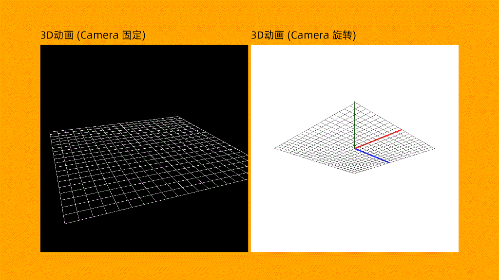

<p align="center">
  
</p>

NewBeeVG(NewBee Visual Content Generator) 是基于 [NewBeeUI](https://github.com/nscript-site/NewBeeUI) 的程序化动画/视频内容生成工具，通过 AI 编程，可以快速的制作视频内容。

NewBeeVG.ThreeD 是 NewBeeVG 的 3D 扩展，它集成了 [HelixToolkit.Nex](https://github.com/helix-toolkit/helix-toolkit-nex) 3D 引擎，提供完整 3D 实时 / 离线渲染、动画能力。

# 运行说明

由于 [HelixToolkit.Nex](https://github.com/helix-toolkit/helix-toolkit-nex) 还在开发阶段，nuget 上的 HelixToolkit.Nex 包和 NewBeeVG.ThreeD 包并不兼容。现阶段，要使用 NewBeeVG 动画，请直接基于源码运行，而非 nuget 包。

# 编译运行

需要下载 [NewBeeVG](https://github.com/nscript-site/NewBeeVG) 的源码和 [NewBeeUI](https://github.com/nscript-site/NewBeeUI) 的源码，放在相同的目录下，运行 ·NewBeeVG.slnx· 文件即可打开项目。

由于 [NewBeeVG](https://github.com/nscript-site/NewBeeVG) 引用了 [HelixToolkit.Nex](https://github.com/helix-toolkit/helix-toolkit-nex) 项目，下载时需要加上 --recurse-submodules 参数，否则会导致编译失败。下载示例: 

```bash
git clone --recurse-submodules https://github.com/nscript-site/NewBeeVG.git
```

# 简单示例

`NewBeeVG.Demo` 项目下 `Canvas3DSample` 是基本的 3D 动画示例。

`apps/files/threed.cs` 是对应的单文件应用 3D 示例:

```csharp
#!/usr/bin/env dotnet

font("阿里巴巴普惠体 2.0");

float len = 10;
float thickness = 5;

HStack([
    VStack([
        TextBlock("3D动画 (Camera 固定)").Font(40, SKColors.Black),
        Canvas3D(800,800,SKColors.Black)
            .Camera(PerspectiveCamera(Vec3(10, 12, -25)))
            .Nodes([
                GroundGrid(10,1,SKColors.White,1),
                Line3D(Vec3(),Vec3(0,0,len),SKColors.Red,thickness)
                    .OnFrameT(e=>e.Sender.End = Vec3(0,0,len*e.pf)),
                Line3D(Vec3(),Vec3(0,len,0),SKColors.Green,thickness)
                    .OnFrameT(e=>e.Sender.End = Vec3(0,len*e.pf,0)),
                Line3D(Vec3(),Vec3(len,0,0),SKColors.Blue,thickness)
                    .OnFrameT(e=>e.Sender.End = Vec3(len*e.pf,0,0)),
            ]).Align(0,-1)
    ]),
    VStack([
        TextBlock("3D动画 (Camera 旋转)").Font(40, SKColors.Black),
        Canvas3D(800,800,SKColors.White).Ref(out var canvas)
            .OnFrame(e=>{ canvas.RotateCamera(2f,0); canvas.ZoomCamera(-0.1f); })
            .Camera(PerspectiveCamera(Vec3(-10, -12, 25)))
            .Nodes([
                GroundGrid(10,1,SKColors.Black,1),
                Line3D(Vec3(),Vec3(0,0,len),SKColors.Red,thickness),
                Line3D(Vec3(),Vec3(0,len,0),SKColors.Green,thickness),
                Line3D(Vec3(),Vec3(len,0,0),SKColors.Blue,thickness),
            ]).Align(0,-1)
    ])
])
.Align(0, 0)
.AsClip(out var clip1, frames: 40, name: "3d");

run(stage(1920, 1080, bg: SKColors.Orange), [clip1]);
```

生成内容:


